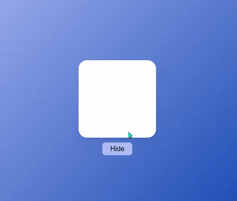
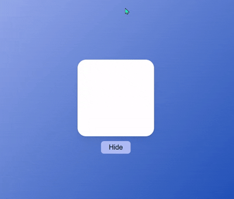
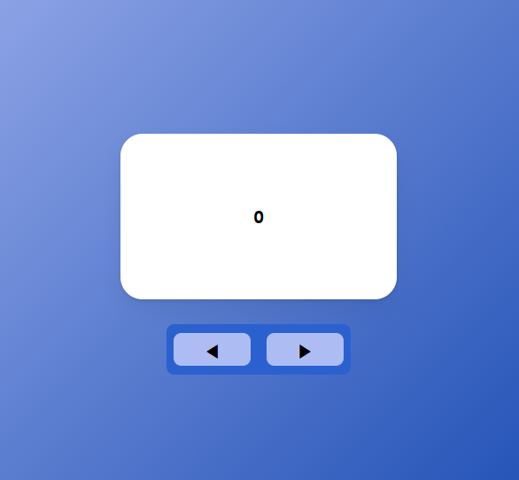

### AnimatePresence, Part 1

#### `AnimatePresence`

- `AnimatePresence`는 요소가 사라질 때의 애니메이션을 구현하기 쉽게 해준다.

- 아래와 같이 기존 `<motion />`을 `<AnimatePresence />`로 감싸주면 <br/>
	해당 `<motion />` Component의 `exit`라는 `props`로 접근할 수 있다.

``` tsx
<AnimatePresence>
	<motion.div 
		initial={{scale: 0}}
		animate={{scale: 1}}
		exit={{scale: 0}}
		transition={{duration: 0.5}}
	/>
</AnimatePresence>
```

- `React`에서 `isHide ? null : <Component />`와 같은 조건식에 의해 <br/>
	Component가 조건부로 Rendering될 때, 조건 식의 결과가 `false`가 되면 <br/>
	해당 Component는 즉시 삭제가 된다.
	
- 즉, 해당 Component가 사라질 때 실행할 Animation을 설정했다고 해도 <br/>
	이게 실행될 틈 없이 바로 해당 Component가 사라져버린다.

- 이때 `<AnimatePresence />`으로 해당 Component 감싸준 상태라면 <br/>
	해당 Component가 조건 식에 따라 삭제가 될 때 바로 삭제되지 않고 <br/>
	`exit` 애니메이션을 먼저 실행한 뒤 삭제가 된다.

* 즉, `<AnimatePresence />`는 `React`와 `Frmaer Motion` 사이의 <br/>
	중재자 역할을 한다고 보면 된다. (`Chatgpt` 답변 참고하였음)
---

#### 예제 1 

``` tsx
//예제 코드 (before)
//'Hide' 버튼을 클릭하면, Box가 사라지는 예제
const Wrapper = styled.div`
	display: flex;
	justify-content: center;
	align-items: center;
	flex-direction: column;
	width: 100vw;
	height: 100vh;
	background: linear-gradient(
		135deg, rgb(174, 188, 244), rgb(8, 62, 171)
	);
`;

const Box = styled(motion.div)`
	width: 180px;
	height: 180px;
	background-color: white;
	border-radius: 20px;
	box-shadow: 0 2px 3px rgba(0, 0, 0, 0.1), 0 10px 20px rgba(0, 0, 0, 0.06);
	margin-bottom: 5px;
`;

const HideBtn = styled.button`
	width: 70px;
	height: 30px;
	font-size: 16px;
	border: 0px;
	border-radius: 7px;
	position: absolute;
	top: 450px;
	background-color: rgb(174, 188, 244);
`;

const BoxVariants = {
	initial: {
		opacity: 0,
		scale: 0
	},
	showing: {
		opacity: 1,
		scale: 1
	}
};

function PresenceExam(){
	const [Hide, setHide] = useState(false);
	const setShowing = () => setHide(!Hide);
	return (
		<Wrapper>
			{
				Hide ? null 
				: (
					<Box 
						variants={BoxVariants}
						initial="initial"
						animate="showing"
						transition={{
							duration: 0.4
						}}
					/>
				)
			}
			<button onClick={setShowing}>
				{Hide ? "Show" : "Hide"}
			</button>
		</Wrapper>
	);
};
```



- 위의 코드는 버튼을 클릭하면, 하얀색 `Box`가 사라지거나, 나타나는 예제이다.
- 이제 여기에 하얀색 `Box`가 사라질 때의 Animation을 추가해보려고 한다.

- 버튼을 클릭하면 `Box`가 보여지거나 숨겨지는 여부를 기억하는 <br/>
	`state`의 값이 바뀌고, 이에 따라 해당 `state`의 값이 `false`이면 <br/>
	`<Box />`가 Rendering되고, `true`면 `null`, `<Box />`가 Rendering되지 않는다.

- 조건 식에 따라 `<Box />`가 삭제될 때, Animation 효과가 <br/>
	실행될 틈 없이 바로 삭제가 되는 것이다.

- 이는 `Framer Motion`의 `<AnimatePresence />` Component 통해서 <br/>
	해결하는 것이 가능하다.
---

#### 예제 1, `<AnimatePresence/> Update`

``` tsx
import {motion, AnimatePresence} from "framer-motion";

const Wrapper = styled.div`...`;
const Box = styled(motion.div)`...`;
const HideBtn = styled.button`...`;

const BoxVariants = {
	initial: {
		opacity: 0,
		scale: 0
	},
	showing: {
		opacity: 1,
		scale: 1
	},
	
	//New
	hiding: {
		opacity: 0,
		x: 100
	}
};

function PresenceExam(){
	const [Hide, setHide] = useState(false);
	
	const setShowing = () => setHide(!Hide);
	
	return (
		<Wrapper>
			<AnimatePresence>
				{
					Hide ? null 
					: (
						<Box 
							variants={BoxVariants}
							initial="initial"
							animate="showing"
							exit={{
								opacity: 0,
								x: 100
							}}
							transition={{
								duration: 0.4
							}}
						/>
					)
				}
			</AnimatePresence>
			<button onClick={setShowing}>
				{Hide ? "Show" : "Hide"}
			</button>
		</Wrapper>
	);
};
```

- 위와 같이 조건 부 Rendering 부분을 `<AnimatePresence>` 감싸준 뒤
	`<motion />`의 `Animation props`인 `exit`에 애니메이션 효과를 전달

- 결과를 확인해보면, `<Box />`가 사라질 때 `exit` 애니메이션이 실행된 후
- `<Box />` Component가 삭제가 되는 것을 확인할 수 있다.



---

### AnimatePresence, Part 2

📔 `#8.12 Slider Part One, #8.13 Slider Part Two`



- `<motion />`에는 `custom`이라는 `props`가 존재한다.
- 해당 `props` 통해 `Variants`에 `JavaScript value` 전달 가능

- `exitBeforeEnter (현재 지원 X)`


