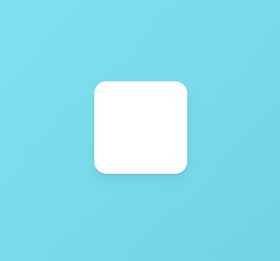
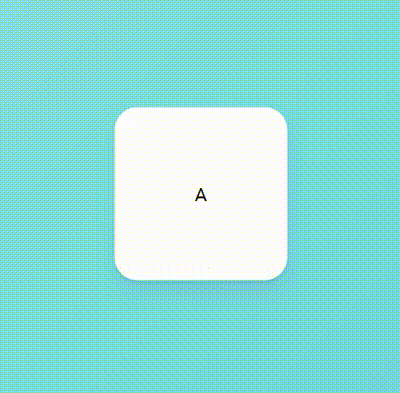

### `Gestures, Part 1`


- `Variants`에서 작업한 내용을 전부 지우고 시작
- `Framer-motion, basic` 예제에서 `Box`의 크기만 조정한 버전이다.

``` tsx
import { motion } from "framer-motion";
import styled from "styled-components";

const Wrapper = styled.div`
	display: flex;
	justify-content: center;
	align-items: center;
	width: 100vw;
	height: 100vh;
`;

const Box = styled(motion.div)`
	width: 150px;
	height: 150px;
	background-color: white;
	border-radius: 20px;
	box-shadow: 0 2px 3px rgba(0, 0, 0, 0.1), 0 10px 20px rgba(0, 0, 0, 0.06);
`;

function Gestures(){
	return (
		<Wrapper>
			<Box />
		</Wrapper>
	);
};
```



- 이제 이 예제를 활용해서 다양한 제스처 효과들을 구현해볼 것이다.

---

#### `Hover`

- 사용자의 `Pointer`가 Component 위로 이동, 떠날 때를 감지하는 제스처
- `pointer`가 Component를 가리키면, 색상이 바뀌거나, 크기가 커지는 등 <br/>
	다양한 제스처 효과들을 구현할 수 있다.

``` tsx
function Gestures(){
	return (
		<Wrapper>
			<Box 
				whileHover={{scale: 1.5, rotateZ: 90}}
			/>
		</Wrapper>
	);
};
```

---

#### `Tap`

- `Component` 클릭을 유지하고 있을 때의 `Animation` 효과를 설정하는 속성

``` tsx
function Gestures(){
	return (
		<Wrapper>
			<Box 
				whileTap={{scale: 2.0}}
			/>
		</Wrapper>
	);
};
```

---
#### `drag`

- Component 끄는 것(drag)이 가능하게 하는 속성, 기본 값은 `false`이다.
- `true` / `"x"` / `"y"` 세 개의 값 사용 가능하다.
	- `true`: 양방향으로 드래그 가능
	- `"x"`: x축으로만 드래그 가능
	- `"y"`: y축으로만 드래그 가능

``` tsx
function Gestures(){
	return (
		<Wrapper>
			<Box 
				drag={true}
			/>
		</Wrapper>
	);
	/*
		drag="x" //x축으로만 드래그 가능
		drag="y" //y축으로만 드래그 가능
	*/
};
```

---

#### `whileDrag`

- 드래그 제스처가 인식되는 동안, 작동할 `Animation` 효과를 명시하는 속성

``` tsx
function Gestures(){
	return (
		<Wrapper>
			<Box 
				drag={true}
				whileDrag={{borderRadius: "100px"}}
			/>
		</Wrapper>
	);
};
```

---

- `hover`, `tap`, `drag` 등의 제스처 속성에는 `Variants` 전달할 수도 있다.

``` tsx
function Gestures(){
	return (
		<Wrapper>
			<Box 
				whileHover={{rotateZ: 90}}
				whileTap={{
					scale: 1.5,
					rotateZ: 360,
					color: "white",
					backgroundColor: "#30336b",
					transition: {
						duration: 0.5
					}
				}}
			>A</Box>
		</Wrapper>
	);
};
```

- 이렇게 설정된 `<Box />` 요소에서 `hover, tap`에 지정된
- Animation 효과를 `Variants` 이관해보자.

``` tsx
const BoxVariants = {
	hover: { rotateZ: 90 },
	click: {
		scale: 1.5,
		rotateZ: 360,
		color: "white",
		backgroundColor: "#30336b",
		transition: {
			duration: 0.5
		}
	}
};

function Gestures(){
	return (
		<Wrapper>
			<Box 
				Variants={BoxVariants}
				whileHover="hover"
				whileTap="click"
			>A</Box>
		</Wrapper>
	);
};
```



- 위와 같이 `BoxVariants` 만들고, `Animation` 설정들을 옮겨줬다.
- 설정을 `variants object` 옮기기만 했기 때문에 예제 실행 결과는 변함 없다.

---

