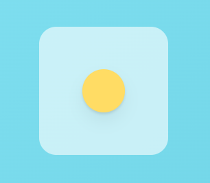

### `Gestures, Part 1`


- `Variants`에서 작업한 내용을 전부 지우고 시작
- `Framer-motion, basic` 예제에서 `Box`의 크기만 조정한 버전이다.

``` tsx
import { motion } from "framer-motion";
import styled from "styled-components";

const Wrapper = styled.div`
	display: flex;
	justify-content: center;
	align-items: center;
	width: 100vw;
	height: 100vh;
`;

const Box = styled(motion.div)`
	width: 150px;
	height: 150px;
	background-color: white;
	border-radius: 20px;
	box-shadow: 0 2px 3px rgba(0, 0, 0, 0.1), 0 10px 20px rgba(0, 0, 0, 0.06);
`;

function Gestures(){
	return (
		<Wrapper>
			<Box />
		</Wrapper>
	);
};
```


- 이제 이 예제를 활용해서 다양한 제스처 효과들을 구현해볼 것이다.

---

#### `Hover`

- 사용자의 `Pointer`가 Component 위로 이동, 떠날 때를 감지하는 제스처
- `pointer`가 Component를 가리키면, 색상이 바뀌거나, 크기가 커지는 등 <br/>
	다양한 제스처 효과들을 구현할 수 있다.

``` tsx
function Gestures(){
	return (
		<Wrapper>
			<Box 
				whileHover={{scale: 1.5, rotateZ: 90}}
			/>
		</Wrapper>
	);
};
```

---

#### `Tap`

- `Component` 클릭을 유지하고 있을 때의 `Animation` 효과를 설정하는 속성

``` tsx
function Gestures(){
	return (
		<Wrapper>
			<Box 
				whileTap={{scale: 2.0}}
			/>
		</Wrapper>
	);
};
```

---
#### `drag`

- Component 끄는 것(drag)이 가능하게 하는 속성, 기본 값은 `false`이다.
- `true` / `"x"` / `"y"` 세 개의 값 사용 가능하다.
	- `true`: 양방향으로 드래그 가능
	- `"x"`: x축으로만 드래그 가능
	- `"y"`: y축으로만 드래그 가능

``` tsx
function Gestures(){
	return (
		<Wrapper>
			<Box 
				drag={true}
			/>
		</Wrapper>
	);
	/*
		drag="x" //x축으로만 드래그 가능
		drag="y" //y축으로만 드래그 가능
	*/
};
```

---

#### `whileDrag`

- 드래그 제스처가 인식되는 동안, 작동할 `Animation` 효과를 명시하는 속성

``` tsx
function Gestures(){
	return (
		<Wrapper>
			<Box 
				drag={true}
				whileDrag={{borderRadius: "100px"}}
			/>
		</Wrapper>
	);
};
```

---

- `hover`, `tap`, `drag` 등의 제스처 속성에는 `Variants` 전달할 수도 있다.

``` tsx
function Gestures(){
	return (
		<Wrapper>
			<Box 
				whileHover={{rotateZ: 90}}
				whileTap={{
					scale: 1.5,
					rotateZ: 360,
					color: "white",
					backgroundColor: "#30336b",
					transition: {
						duration: 0.5
					}
				}}
			>A</Box>
		</Wrapper>
	);
};
```

- 이렇게 설정된 `<Box />` 요소에서 `hover, tap`에 지정된
- Animation 효과를 `Variants` 이관해보자.

``` tsx
const BoxVariants = {
	hover: { rotateZ: 90 },
	click: {
		scale: 1.5,
		rotateZ: 360,
		color: "white",
		backgroundColor: "#30336b",
		transition: {
			duration: 0.5
		}
	}
};

function Gestures(){
	return (
		<Wrapper>
			<Box 
				Variants={BoxVariants}
				whileHover="hover"
				whileTap="click"
			>A</Box>
		</Wrapper>
	);
};
```


- 위와 같이 `BoxVariants` 만들고, `Animation` 설정들을 옮겨줬다.
- 설정을 `variants object` 옮기기만 했기 때문에 예제 실행 결과는 변함 없다.

---

### `Gestures, Part 2`

- `drag`, `Animation effect` 설정은 다음과 같다.

``` tsx
const BoxVariants = {
	drag: {
		scale: 0.5,
		borderRadius: "100px",
		border: "2px solid black",
		backgroundColor: "rgb(41, 128, 185)",
		transition: { duration: 2 }
	}
}

function Gestures(){
	return (
		<Wrapper>
			<Box 
				Variants={BoxVariants}
				drag
				whileDrag="drag"
			>A</Box>
		</Wrapper>
	);
};
```

- 위의 드래그 예제는 상하좌우 어느 방향이든 거의 무제한으로 드래그가 된다.
- 이제 위의 예제에서 `dragConstraints` 속성을 활용해서 <br/>
	드래그 가능한 영역에 제한을 걸어보도록 하겠다.

---

#### `dragConstraints`

- 드래그 가능한 영역에 제약 조건을 적용하는 `props`

``` tsx
function Gestures(){
	return (
		<Wrapper>
			<Box 
				Variants={BoxVariants}
				drag
				whileDrag="drag"
				dragConstraints={{
					top: -50,
					bottom: 50,
					left: 50,
					right: -50
				}}
			>A</Box>
		</Wrapper>
	);
};
```


- 위의 이미지처럼 전과 달리 드래그 가능한 영역에 제한이 생긴 것을 확인할 수 있다.

---

- 이번엔 새로운 예제를 준비해봤다.



``` tsx
const Wrapper = styled.div``;
const Box = styled.div`
	width: 150px;
	height: 150px;
	background-color: rgba(255, 255, 255, 0.6);
	border-radius: 20px;
	display: flex;
	justify-content: center;
	align-items: center;
`;

const Circle = styled(motion.div)`
	width: 50px;
	height: 50px;
	background-color: rgb(255, 220, 100);
	border-radius: 25px;
	box-shadow: 0 2px 3px rgba(0, 0, 0, 0.1), 0 10px 20px rgba(0, 0, 0, 0.06);
`;

function Gestures(){
	return (
		<Wrapper>
			<Box>
				<Circle />
			</Box>
		</Wrapper>
	);
}
```

- 위의 이미지에서 노란색 공을 흰색 박스 안에서 움직일 수 있게 해보자.
- 방법은 총 두 가지가 존재한다.
- 하나는 `dragConstranints`의 값을 `Box`의 크기만큼 제한하는 것이다.

- 또 다른 방법은 `ref`라는 것을 이용하는 방법이다.
- `useRef()` Hook 통해서 참조, `ref` 생성한다.
- 이를 통해서 `<Box />`가 `<Circle />`의 일부 정보 (좌표,..) 기억하게 한다. <br/>
	이때 Component의 Re-rendering 발생하지 않는다.

``` tsx
import {useRef} from "react";

const Wrapper = styled.div``;
const Box = styled.div`
	width: 150px;
	height: 150px;
	background-color: rgba(255, 255, 255, 0.6);
	border-radius: 20px;
	display: flex;
	justify-content: center;
	align-items: center;
	overflow: hidden;
`;

const Circle = styled(motion.div)`
	width: 50px;
	height: 50px;
	background-color: rgb(255, 220, 100);
	border-radius: 25px;
	box-shadow: 0 2px 3px rgba(0, 0, 0, 0.1), 0 10px 20px rgba(0, 0, 0, 0.06);
`;

function Gestures(){
	const BoxRef = useRef<HTMLDivElement>(null);
	return (
		<Wrapper>
			<Box ref={BoxRef}>
				<Circle 
					variants={BoxVariants}
					drag
					dragConstraints={BoxRef}
				/>
			</Box>
		</Wrapper>
	);
}
```

- `<Box />`에 `overflow: hidden` 속성을 추가하고
- `useRef()` Hook으로 `BoxRef`라는 참조 요소를 만들고 <br/>
	`Circle` 드래그 하는 동안 `re-render` 되지 않도록 <br/>
	`<Box />`에 `ref`로 전달한다.
- 이후 `Circle`에서 드래그 제한 영역을 앞에서 만든 `BoxRef` 설정하면 <br/>
	`Circle`을 `Box` 안에서만 드래그 할 수 있다.
- `Box` 밖으로 넘어가는 것은 `overflow: hidden` 속성을 통해서 <br/>
	보이지 않게 설정하였다.


---

- 아쉬운 점이 하나 있다면, 노란색 공을 드래그 한 뒤 <br/>
	놓으면 원래 위치, 정중앙으로 돌아가지 않는다는 점이다.
- 이는 `dragSnapToOrigin` 속성을 추가하는 것으로 설정할 수 있다.

``` tsx
function Gestures(){
	const BoxRef = useRef<HTMLDivElement>(null);
	return (
		<Wrapper>
			<Box ref={BoxRef}>
				<Circle 
					variants={BoxVariants}
					drag
					dragConstraints={BoxRef}
					dragSnapToOrigin={true}
				/>
			</Box>
		</Wrapper>
	);
}
//dragSnapToOrigin={true}, dragSnapToOrigin
//둘 중 어느 걸로 해도 적용이 된다.
```


