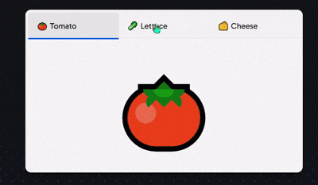
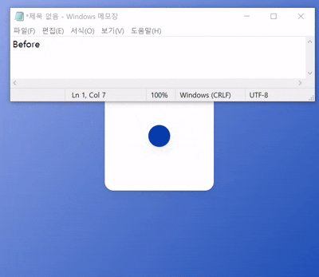
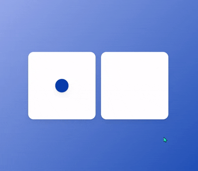
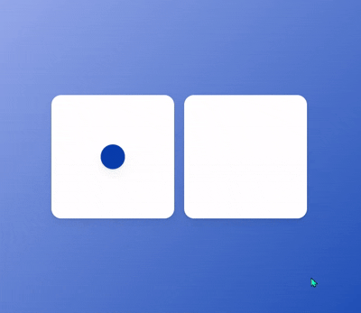
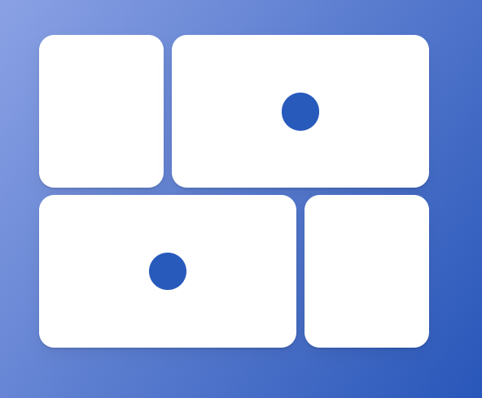
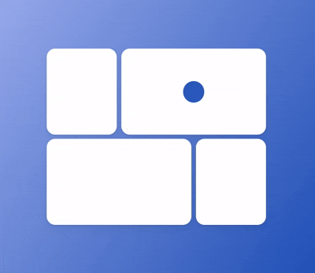
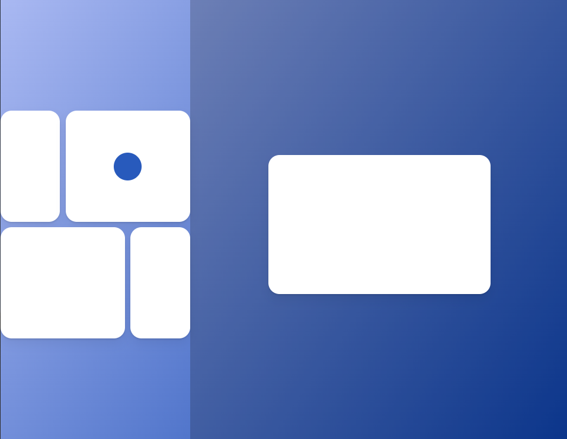
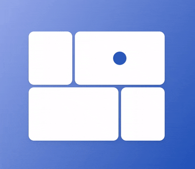
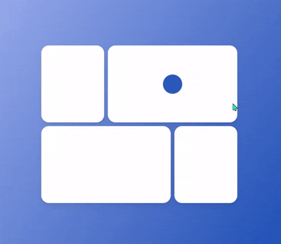
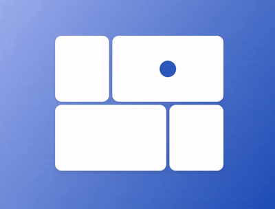

### `Layout Animations`

#### `layout props`

- `<motion />`의 `'layout' props`의 값을 `true` 설정하면 <br/>
	컴포넌트의 `layout`이 변할 때 자동으로 애니메이션 효과를 적용한다.

``` tsx
<motion.div 
	layout
	style={{justifyContent: true: "flex-start" : "flex-end"}}
/>
```

- `layout props` 통해서 이런 식의 애니메이션 효과를 구현할 수 있다.



---
#### `Shared layout Animation`

- `'layoutId' props`는 동일한 `layoutId` 가진 `<motion />` 간의 <br/>
	애니메이션 효과를 적용할 수 있다.
- `layoutId` 가진 새 컴포넌트가 랜더링되고, 다른 컴포넌트가 제거되면 <br/>
	이전 컴포넌트에서 새 컴포넌트로 랜더링되는 과정에서 <br/>
	애니메이션이 실행된다.

``` tsx
return (
	<div>
		<Box>
			{
				isClick ? <motion.div layoutId="circle" /> : null
			}
		</Box>
		<Box>
			{
				isClick ? null : <motion.div layoutId="circle" />
			}
		</Box>
	</div>
);
```
---

### 예제

#### 예제 1

``` tsx
import {styled} from "styled-components";
import {motion} from "framer-motion";
import {useState} from "react";

const Wrapper = styled.div`
	display: flex;
	justify-content: center;
	align-items: center;
	width: 100vw;
	height: 100vh;
	background: linear-gradient(135deg, rgb(174, 188, 244), rgb(8, 62, 171));
`;

const Box = styled.div`
	width: 250px;
	height: 250px;
	display: flex;
	background-color: white;
	border-radius: 20px;
	box-shadow: 0 2px 3px rgba(0, 0, 0, 0.1), 0 10px 20px rgba(0, 0, 0, 0.06);
`;

const Circle = styled(motion.div)`
	width: 50px;
	height: 50px;
	border-radius: 25px;
	background-color: rgb(8, 62, 171);
	box-shadow: 0 2px 3px rgba(0, 0, 0, 0.1), 0 10px 20px rgba(0, 0, 0, 0.06);
`;

function Layout(){
	const [Click, setClick] = useState(false);
	const isClick = () => setClick((clicked) => !clicked);
	
	return (
		<Wrapper onClick={isClick}>
			<Box 
				style={{
					justifyContent: Click ? "center" : "flex-start",
					alignItems: click ? "center" : "flex-start"
				}}
			>
				<Circle />
			</Box>
		</Wrapper>
	);
}
```

- 화면을 클릭하면 박스 내부에 있는 공의 위치가 바뀌는 간단한 예제이다.
- `state` 통해서 `Click` 여부를 관리하고, 이에 따라 `Box` 하위 요소의 <br/>
	배치 방식을 변경하는 형태로 해서 예제를 구현하였다.

- 여기서 `layout`이 달라지는 요소는 `<Circle />`이기 때문에 <br/>
	해당 `Component`에 `layout props` 추가해보자.

``` tsx
function Layout(){
	/* 기존 코드 */
	return (
		<Circle layout />
	);
}
```

- 예제를 다시 확인해보면 화면 클릭 시 `<Circle />`의 위치가 바뀔 때 <br/>
	`Circle`에 애니메이션 효과가 추가된 것을 확인할 수 있다.



---

#### 예제 2

- 이번에는 예제에서 `Box`와 `Circle` 컴포넌트를 하나 더 추가해보자.

``` tsx
import {styled} from "styled-components";
import {motion} from "framer-motion";
import {useState} from "react";

const Wrapper = styled.div`...`;

const Box = styled.div`
	width: 250px;
	height: 250px;
	display: flex;
	background-color: white;
	border-radius: 20px;
	box-shadow: 0 2px 3px rgba(0, 0, 0, 0.1), 0 10px 20px rgba(0, 0, 0, 0.06);
	
	/*New*/
	justify-content: center;
	align-items: center;
	margin: 10px;
`;

const Circle = styled(motion.div)`...`;

function Layout(){
	const [Click, setClick] = useState(false);
	const isClick = () => setClick((clicked) => !clicked);
	
	return (
		<Wrapper onClick={isClick}>
			<Box>
				{Click ? <Circle /> : null}
			</Box>
			<Box>
				{Click ? null : <Circle />}
			</Box>
		</Wrapper>
	);
}
```

- 이전 예제에서 `Box` 하나 더 추가한, 화면 클릭 시 `Circle`의 위치가 바뀌는 예제이다.



- 화면 클릭 여부를 관리하는 `state`이 `true/false`냐에 따라 <br/>
	`<Circle />`를 Rendering하거나 아니면 `null`을 return한다.

- 시각적으로 봤을 때 화면을 클릭하면 두 `Box` 사이에서 <br/>
	`Circle`의 위치가 바뀌는 형태이다.

- 이제 `<Circle />`에 `layoutId` 추가해보자.

``` tsx
function Layout(){
	const [Click, setClick] = useState(false);
	const isClick = () => setClick((clicked) => !clicked);
	
	return (
		<Wrapper onClick={isClick}>
			<Box>
				{Click ? <Circle layoutId="circle"/> : null}
			</Box>
			<Box>
				{Click ? null : <Circle layoutId="circle"/>}
			</Box>
		</Wrapper>
	);
}
```



- `state, 'Click'`의 값에 따라 `<Box />` 컴포넌트 내부의 <br/>
	`<Circle />`이 랜더링되거나 삭제되는 과정의 애니메이션이 추가됐다.

- 화면을 클릭하면 두 개의 `Box` 사이에서 `Circle`이 움직이는 것 같은 <br/>
	애니메이션 효과가 자동으로 추가된 것을 확인할 수 있다.

---
### Final Project

#### 예제 설명



- `framer-motion` 라이브러리 학습 과정, 마지막 예제
- 강의에서 사용됐던 예제와 이전 파트 (`Layout`) 마지막 예제 <br/>
	총 두 가지를 섞어 놓은 버전이다.
	
- 위의 사진에서 파란색 공이 있는 `Box`를 `2, 3` <br/>
	공이 없는 `Box`를 `1, 4`번으로 칭하겠다.

- `1, 4번 Box`는 클릭하면 해당 박스가 정중앙에 확대된 형태로 나오고 <br/>
	`2, 3번 Box`에는 확대 기능은 없고, 화면 클릭 시 내부의 파란색 공을 주고 받는 <br/>
	형태의 애니메이션 효과를 만들어 볼 것이다.

- 기본적인 소스코드는 다음과 같다.

``` tsx
//Final Project Sample Code
import {motion} from "framer-motion";
import styled from "styled-components";

const Wrapper = styled.div`
	width: 100vw;
	height: 100vh;
	display: flex;
	align-items: center;
	justify-content: center;
	background: linear-gradient(125deg, rgb(174, 188, 244), rgb(8, 62, 171));
`;

const GridContainer = styled.div`
	display: grid;
	grid-template-columns: repeat(3, 1fr);
	div:nth-child(2){
		grid-column: span 2;
	};
	
	div:nth-child(3){
		grid-column: span 2;
	};
	
	width: 50vw;
	gap: 10px;
`;

const Box = styled(motion.div)`
	height: 200px;
	display: flex;
	justify-content: center;
	align-items: center;
	background-color: white;
	border-radius: 20px;
	box-shadow: 0 2px 3px rgba(0, 0, 0, 0.1), 0 10px 20px rgba(0, 0, 0, 0.06);
`;

const Circle = styled(motion.div)`
	width: 50px;
	height: 50px;
	background-color: rgb(40, 90, 188);
	border-radius: 30px;
`;

function FinalExam(){
	return (
		<Wrapper>
			<GridContainer>
				<Box key="box1"/>
				<Box key="box2">
					<Circle />
				</Box>
				<Box key="box3">
					<Circle />
				</Box>
				<Box key="box4"/>
			</GridContainer>
		</Wrapper>
	);
}
```

---

#### `Box 2, 3`, `Circle` 이동 구현하기

- 제일 먼저 `Box 2, 3`에 있는 `Circle`의 이동 기능을 구현해보겠다.
- 구현 과정은 이전, `Layout, 예제2` 에서 더 자세하게 설명했으니 <br/>
	간략하게 보여주기만 하고 넘어가도록 하겠다.

```
구현 과정
- 화면 클릭 여부를 기억해둘 boolean 값을 가지는 state를 만들고
- 'Wrapper'의 onClick Event Listener 통해서 이를 관리한다.
- 그리고 해당 state의 값에 따라 2, 3번 Box의 <Circle /> 랜더링 여부를 결정
  state == false => 2번 Box, <Circle /> Render, 아니면 null return
  state == true => 3번 Box, <Circle /> Render, 아니면 null return
  
- 마지막으로 2개의 <Circle />에 동일한 layoutId 설정
  <Circle />이 Render, delete되는 과정에서의 animation 효과 추가한다.
```

``` tsx
//화면 클릭 시, Circle이 2, 3번 박스를 왔다갔다하는 기능 구현
function FinalExam(){
	const [Move, setMove] = useState(false);
	const isCircleMove = () => setMove((prev) => !prev);
	
	return (
		<Wrapper onClick={isCircleMove}>
			<GridContainer>
				<Box key="box1"/>
				<Box key="box2">
					{!Move ? <Circle layoutId="circle"/> : null}
				</Box>
				<Box key="box3">
					{Move ? <Circle layoutId="circle"/> : null}
				</Box>
				<Box key="box4"/>
			</GridContainer>
		</Wrapper>
	);
};
```



---
#### `Box 1, 4` 확대 기능 구현하기 1

- 제일 먼저 `Box 1, 4` 클릭하면 나오는 화면부터 구현하기로 했다.
- 기본적인 Style 설정은 다음과 같이 하였다.

``` tsx
const OverlayViews = styled.div`
	width: 100%;
	height: 100%;
	display: flex;
	justify-content: center;
	align-items: center;
	background-color: rgba(0, 0, 0, 0.2);
	position: absolute;
`;
```

- `position: absolute`로 설정하지 않으면, 아래 사진과 같이 <br/>
	전체 요소 흐름에 따라 배치가 되기 때문에 `absolute` 설정해서 <br/>
	요소 흐름의 영향을 받지 않게 해줘야 한다.



---

- `Box 1, 4`의 클릭 여부를 관측하는 `boolean 'state'` 하나 만들고 <br/>
	두 `<Box />` Component의 `onClick={}` 통해서 해당 `state` 값을 관리한다.

- 그 다음, 해당 `state`의 값이 `true`일 때만 `<OverlayViews />`를 Render <br/>
	`false`인 경우에는 Render하지 않도록 설정한다. (삼항 연산자)

``` tsx
const OverlayViews = styled.div`...`

function FinalExam(){
	const [Move, setMove] = useState(false);
	const isCircleMove = () => setMove((prev) => !prev);
	
	const [BoxId, setBoxId] = useState(false);
	const isBoxClicked = () => setBoxId((prev) => !prev);
	
	return (
		<Wrapper>
			<GridContainer>
				<Box key="box1" onClick={isBoxClicked}/>
				<Box key="box2" onClick={isCircleMove}>
					{!Move ? <Circle layoutId="circle"/> : null}
				</Box>
				<Box key="box3" onClick={isCircleMove}>
					{Move ? <Circle layoutId="circle"/> : null}
				</Box>
				<Box key="box4" onClick={isBoxClicked}/>
			</GridContainer>
			{
				BoxId ? (
					<OverlayViews>
						<Box 
							onClick={isBoxClicked} 
							style={{width: 400, height: 250}}
						/>
					</OverlayViews>
				) : null
			}
		</Wrapper>
	);
};
```



- 최종적인 결과물은 위와 같이 된다.
- 추가적으로 이전 예제에서 수정한 점이 하나 있는데 <br/>
	기존에 `Wrapper`에 추가했던 `Circle`의 Render 여부를 결정하던 <br/>
	`onClick event Listener`를 `Box 2, 3`으로 이관시킨 점이다.

- `Circle`과 연관이 없는 `Box 1, 4` 클릭했을 때, `Circle`의 위치에 영향이 가는 건 <br/>
	조금 아닌 것 같은 느낌이 들어서 `onClick Event Listener`를 `Box 2, 3`으로 옮겼다.

- 이제 `OverlayViews` 내부의 `<Box />`와 `Box 1, 4`번에 `layoutId` 추가해보자.

``` tsx
function FinalExam(){
	/*기존 코드*/
	return (
		<Wrapper>
			<GridContainer>
				<Box key="box1" layoutId="OverlayBox" onClick={isBoxClicked}/>
				<Box key="box2" onClick={isCircleMove}>
					{!Move ? <Circle layoutId="circle"/> : null}
				</Box>
				<Box key="box3" onClick={isCircleMove}>
					{Move ? <Circle layoutId="circle"/> : null}
				</Box>
				<Box key="box4" layoutId="OverlayBox" onClick={isBoxClicked}/>
			</GridContainer>
			{
				BoxId ? (
					<OverlayViews>
						<Box 
							layoutId="OverlayBox"
							onClick={isBoxClicked} 
							style={{width: 400, height: 250}}
						/>
					</OverlayViews>
				) : null
			}
		</Wrapper>
	);
};
```



- 예제를 실행해보면 `Box 1, 4` `<OverlayView />` 내부의 `<Box />` 요소 간 <br/>
	애니메이션 효과가 적용된 것을 확인할 수 있다.

- 다만 그 이후에 `Box 1`이 화면 상 사라진 것을 확인할 수 있다.
- 개발자 Console로 확인해보니, `Box 1`이 삭제된 것은 아니고 <br/>
	 `Box 1, 4`가 겹쳐진 것을 확인할 수 있었다.

- 아마 `Box 1, 4`가 동일한 `layoutId` 가졌기 때문에 발생한 문제 같다.

---
#### `Box 1, 4` 확대 기능 구현하기 2 

- **`layoutId 중복 issue 해결 과정`**

- 결국은 `1, 4번 <Box />`의 `layoutId`가 중복되는 것이 문제이니
- 사용자가 클릭한 `<Box />`의 `id`를 `onClick Event` 통해 `state`에 저장
- 해당 `state` 값을 `OverlayView - <Box />`의 `layoutId`로 전달한다.

- 이를 통해서 `framer-motion`이 `<Box id="[box1 or box4]"/>`와 <br/>
	`OverlayView - <Box layoutId={state == ["box1" or "box4"]}/>` <br/>
	두 Component를 동일한 것으로 인식, 애니메이션 적용한다.

``` tsx
function FinalExam(){
	/*기존 코드*/
	const [BoxId, setBoxId] = useState("");
	
	const isBoxClicked = (event: React.MouseEvent) => {
		const {
			currentTarget: {id}
		} = event;
		setBoxId(id);
		//Click한 <Box />의 id를 받아와서 state 저장
	}
	
	return (
		<Wrapper>
			<GridContainer>
				<Box id="box1" layoutId="box1" onClick={isBoxClicked}/>
				<Box id="box2" onClick={isCircleMove}>
					{!Move ? <Circle layoutId="circle"/> : null}
				</Box>
				<Box id="box3" onClick={isCircleMove}>
					{Move ? <Circle layoutId="circle"/> : null}
				</Box>
				<Box id="box4" layoutId="box4" onClick={isBoxClicked}/>
			</GridContainer>
			{
				BoxId ? (
					<OverlayViews>
						<Box 
							layoutId={BoxId}
							onClick={() => setBoxId("")} 
							style={{width: 400, height: 250}}
						/>
					</OverlayViews>
				) : null
			}
		</Wrapper>
	);
};

```

 

- `box1, box4`에 개별적인 `layoutId`를 주고
- 클릭한 `<Box />`의 `id`를 `OverlayViews - <Box />`가 `layoutId` 참조한다.
- `Render`, `Delete` 되는 과정에서 자동으로 애니메이션 효과가 추가
- `<OverlayViews />`에서 원래 화면으로 돌아오는 과정에서 <br/>
	`box1, box4`가 하나로 겹치던 문제도 해결됐다.

- 이걸로 기본적인 것은 전부 완료됐다.
- `framer-motion` 라이브러리를 학습하는데 대략 한달 정도가 걸린 것 같다.
- 중간에 코드 챌린지나 이런 기간도 있긴 했지만 생각보단 시간이 오래 걸렸다.

- 다음주는 React 강의 수강은 잠시 멈춰두고
- Side Project인 `Daily Planner`에 좀 집중해야겠다.
- **完**
---


