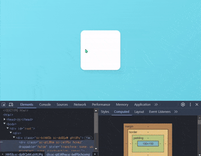
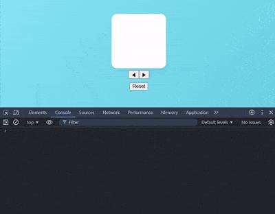

### MotionValues, Part 1

- **📆 학습 일: 2024.12.25 수요일**
---

#### `MotionValue`

- `Animation` 값의 `상태 state`와 `속도 Velocity` 추적하는 것

- `motion Components`는 내부적으로 `MotionValues` 사용해서 <br/>
	`Animation` 값의 상태와 속도를 추적하고, 별도 명시하지 않아도 <br/>
	자동으로 생성이 된다.

- 여기서 `MotionValue`는 `React State`가 아니기 때문에 <br/>
	`MotionValue` 값이 바뀌어도 `Re-render` 발생하지 않는다.
	
- `MotionValues`는 아래와 같이 `useMotionValue()` Hook 통해서 생성 가능하고 <br/>
	`useMotionValue()`에 전달한 값은 `MotionValue`의 초기 상태로 작동한다.

``` tsx
import {motion, useMotionValue} from "framer-motion";

function MyComponents(){
	const x = useMotionValue(0);
	
	return (
		<motion.div style={{x}} />
	);
}
```

- `useMotionValue()` Hook에는 인자의 Type은 `number`인 점 유의해두자.
- 보통 초기 값으로는 숫자 `0` 전달한다.

#### `MotionValue, method's`

- **`x.set(100)`**
	- `MotionValue`의 값을 인자로 전달한 값으로 바꾸는 메서드
	- `re-render` 발생하지 않는다.

- **`x.get()`**
	- `MotionValue`의 값을 읽는 메서드

---

#### `useMotionValueEvent()`

``` tsx
function MyComponents(){
	const x = useMotionValue(0);

	useMotionValueEvent(
		x, "change", (latest) => console.log(`x = ${x}`)
	);
	
	return <motion.div style={{x}} />
}
```

- `useMotionValueEvent()` 함수는 React Component의 수명 주기동안 <br/>
	`Motion Value`의 `event handler`를 관리하는 함수

- `useMotionValueEvent()`는 아래 세 개의 인자를 전달 받는다. <br/>
	(`MotionValue, eventName, callback`)

- 이때 설정 가능한 `event`는 다음과 같다.
- `change`, `animationStart``animationComplete`, `animationCancel`
	- `change`는 `MotionValue`의 최신 값 (`latest value`)을 제공해준다.

- **[공식 문서 / useMotionValueEvent](https://motion.dev/docs/react-use-motion-value-event)**


---

#### `MotionValue`, 예제

- 아래와 같이 `framer-motion`의 기본 예제를 불러왔다.
- 여기서 `drag`와 관련된 속성 몇 개를 추가하였다.
	- `drag="x"`
	- `dragSnapToOrigin`

``` tsx
import styled from "styled-components";
import {BasicExams} from "./BasicExam";

const MotionWrapper = styled(BasicExams.Wrapper)``;
const MotionBox = styled(BasicExams.Box)``;

function MotionValues(){
	return (
		<MotionWrapper>
			<MotionBox 
				drag="x"
				dragSnapToOrigin
			/>
		</MotionWrapper>
	);
};
```

- 예제를 실행하면 하얀색 박스가 나오고 <br/>
	해당 박스를 x축 방향으로 드래그할 수 있다.

- 마우스 커서를 떼면 다시 초기 위치, 정중앙으로 돌아온다.

	


- 이제 `MotionValue` 활용해서 `Box`의 `x축` 방향 값을 추적하고 <br/>
	이를 활용해서 `Box`의 위치에 따라 배경 색상이 달라지게 해보자.

- 아래와 같이 `useMotionValue()` Hook을 활용해서 `MotionValue` 생성하고 <br/>
	그 값을 `Box`의 `transform: translateX()`와 연동하였다.

``` tsx
import styled from "styled-components";
import {BasicExams} from "./BasicExam";

const MotionWrapper = styled(BasicExams.Wrapper)``;
const MotionBox = styled(BasicExams.Box)``;

function MotionValues(){
	const x = useMotionValue(0);
	
	return (
		<MotionWrapper>
			<MotionBox 
				drag="x"
				dragSnapToOrigin
				style={{x}}
			/>
		</MotionWrapper>
	);
};
```

- `Box`의 위치 값, `MotionValue`의 값을 `console`에서 확인하고 싶지만 <br/>
	`MotionValue`는 `React State`가 아니기 때문에 값이 바뀌어도 <br/>
	이를 `console`에서 확인할 방도가 없다. (`re-render` 안되기 때문)

- 강의에선 아래와 같이 `useEffect()` 활용해서 <br/>
	`Box`의 `MotionValue` 추적했지만 이 강의를 듣는 시점에선 <br/>
	사용할 수 없는 방법이라고 한다.

- 대신 `useMotionValueEvent()` Hook을 통해서 해결할 수 있었다.

``` tsx
import {useMotionValue, useMotionValueEvent} from "framer=motion";
//import {useEffect} from "react";

/*
	기존 styled-components
*/

function MotionValues(){
	const x = useMotionValue(0);
	
	/*
		useEffect(x.onChange() => {
			console.log(x.get());
		}, [x]);
	*/
	
	useMotionValueEvent(
		x, "change", (values) => console.log(values)
	);
	
	return (
		/*기존 코드*/
	);
};
```

- 이제 `Box`를 움직일 때마다, 위치 값을 console에서 확인할 수 있게 됐다.

	

- `MotionValue`는 `React State`가 아니기 때문에, 값이 바뀌어도 <br/>
	`Re-render`되지 않으면서 `Box`의 위치 값이 실시간으로 `console`에 출력된다.

- 다음 장으로 넘어가기 전에 기능 하나를 좀 추가하였다.
- 버튼 세 개를 새로 추가했는데 각 버튼의 역할은 다음과 같다.
	- `[◀]` : `Box`를 좌측 방향으로 옮기는 버튼
	- `[▶]` : `Box`를 우측 방향으로 옮기는 버튼
	- `[Reset]`: `Box`를 초기 위치로 돌려놓는 버튼 (초기 위치: `0`)

- 아래 이미지처럼 클릭한 버튼에 따라 `Box`의 위치가 달라진다.

	

- `MotionValue`의 `get()`, `set()` method를 통해서 위의 기능을 구현했다.
	- **[`MotionValue, method`](https://motion.dev/docs/react-motion-value)**

- 소스 코드는 다음과 같이 작성하였다.

``` tsx
function MotionValues(){
	const x = useMotionValue(0);
	
	const MoveLeft = () => {
		const oldX = x.get();
		const newX = x.set(oldX - 50);
		
		return newX;
	};
	
	const MoveRight = () => {
		const oldX = x.get();
		const newX = x.set(oldX + 50);
		
		return newX;
	};
	
	useMotionValueEvent(
		x, "change", (latest) => console.log(`x = ${latest}`)
	);
	
	return (
		<Wrapper>
			<Box 
				drag="x"
				dragSnapToOrigin
				style={{x}}
			/>
			<div>
				<button onClick={MoveLeft}>◀</button>
				<button onClick={MoveRight}>▶</button>
			</div>
			<button onClick={() => x.set(0)}>Reset</button>
		</Wrapper>
	);
}
```
---

### MotionValues, Part 2

- **📆 학습 일: 2024.12.25 ~ 26**

---

#### `useTransform()`


