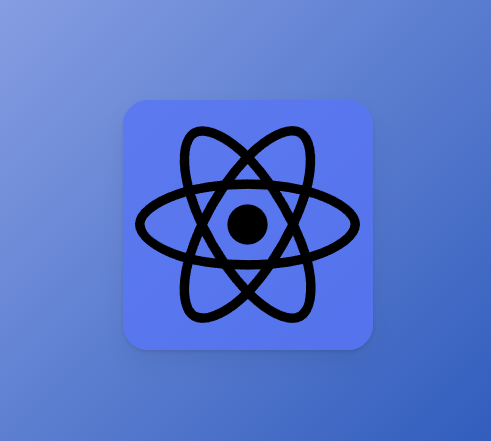
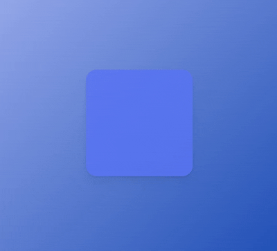
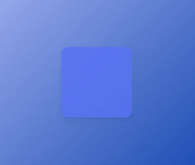

### SVG Animation


- 이번에 만들어볼 것은 로고 애니메이션이다.
- 이번 예제에서 사용한 로고는 아래 웹 사이트에서 받아왔다.
- **[Font Awesome](https://fontawesome.com/)**

- 필자는 `React` 로고를 가져와서 사용하긴 했지만
- 위의 웹 사이트에는 다양한 로고가 존재하기 때문에
- 취향에 맞는 걸로 사용하면 될 것이다.

---

- `Font Awesome`에서 `React` 로고의 `SVG` 코드를 `복사 + 붙여넣기`
- 적용한 결과는 다음과 같다.



``` tsx
const Wrapper = styled.div`
	display: flex;
	justify-content: center;
	align-items: center;
	width: 100vw;
	height: 100vh;
	background: linear-gradient(135deg, rgb(174, 188, 244), rgb(8, 62, 171));
`;
const Box = styled.div`
	width: 200px;
	height: 200px;
	background-color: rgba(88, 116, 245, 0.8);
	border-radius: 20px;
	box-shadow: 0 2px 3px rgba(0, 0, 0, 0.1), 0 10px 20px rgba(0, 0, 0, 0.06);
	display: flex;
	justify-content: center;
	align-items: center;
`;

const Logos = styled.svg`
	width: 180px;
	height: 180px;
`;

function SVGExam(){
	return (
		<Wrapper>
			<Box>
				<Logos xmlns="http://www.w3.org/2000/svg" viewBox="0 0 512 512">
					<motion.path d="..."/>
				</Logos>
			</Box>
		</Wrapper>
	);
}
```

- `<SVG />` 요소를 `styled-components`로 바꿔주고
- `Animation` 효과를 적용하기 위해서 `<path />`를 `<motion.path />` 변경하였다.

- 본격적으로 `Logo` 애니메이션 효과를 구현하기 전에
- 이걸 배우는 시점에서 `<svg />` 요소에 대해 잘 모르기 때문에 <br/>
	간략하게 `<svg />` 요소에 대해 다루고 넘어가도록 하겠다.

---
### `<svg />`

- `svg` => Scable Vector Graphics, XML 기반의 W3C 그래픽 표준 권고안
- 크기를 확대, 축소할 수 있는 수학적 함수를 이용해서  <br/>
	도형이나 선을 그려서 표현한 그래픽
- `px` 기반인 웹 페이지에서 픽셀의 영향을 받지 않는 `Vector` 이미지를 표현 가능
- `jpg, png, gif` 등의 이미지와 다르게 확대해도 해상도가 떨어지지 않는다.

``` html
<svg xmlns="http://www.w3.org/2000/svg" viewBox="0 0 512 512">
	<path d="..."/>
</svg>
```

#### `<svg>`의 `props`

- `xmlns` : XML 문서의 속성, namespace 의미한다.

- **`viewBox`**
	- `svg` 요소가 그려지는 영역에서, `svg`의 크기를 확대, 축소 <br/>
		그리고 위치를 조정할 수 있는 속성
		
	- `viewBox` 속성 없이도, 화면에 그릴 수는 있지만 <br/>
		이 경우에는 `svg` 요소의 크기가 고정된다.
		
	- `viewBox` 속성을 사용하면 화면 크기에 따라 <br/>
		`svg` 요소의 크기가 자동 조절된다.
		
	- 반응형 웹을 설계한다면 필수적으로 명시해야 하는 속성

	- `viewBox` 속성에 전달되는 값은 다음과 같은 형태이다.
	- `viewBox="[min-x] [min-y] [width] [height]"`
		- `(min-x, min-y)` 기준으로 `width * height` 크기의 사각형을 출력한다.
		- `viewBox="0, 0, 512, 512"`라면 `(0, 0)` 기준으로 <br/>
			`512 * 512px`의 화면을 `<svg />` 요소에 출력한다.

---

#### `<path />`

- `<svg />`에서 사용 가능한 다양한 도형을 그리는 요소 중 하나
- 사각형, 원, 타원, 다각형 등 다양한 도형을 그릴 수 있게 해준다.

- `svg`에서 그릴 도형의 모양은 `<path />` 요소의 `d` 속성에서 정의된다.
- 여기서 `d` 속성은 여러 개의 명령어와 Parameter로 구성됐다.

- 여기서 `path`에 대해 자세하게 다루지는 않고
- 이번 예제에서 사용할 몇 가지 `props`만 다룰 것이기에
- 상세한 내용은 아래 공식 문서 링크를 참고하길 바란다.

- **[SVG 튜토리얼 / 패스](https://developer.mozilla.org/ko/docs/Web/SVG/Tutorial/Paths)**

---

#### `<path />, props 몇 가지`

- `fill` : 도형을 채울 색상을 설정하는 속성
- `stroke`: 도형의 테두리 색상을 설정하는 속성
	- `stroke-width`: 도형의 테두리 굵기를 설정하는 속성
- `pathLength`: 도형을 그리는 선, 경로(path) 길이를 지정하는 속성

``` html
<svg xmlns="http://www.w3.org/2000/svg" viewBox="0 0 512 512">
	<path d="..."
		fill="rgba(255, 255, 255, 0)"
		stroke="currentColor"
		stroke-width="2"
	/>
</svg>
```

---

### SVG Animation 예제

- `<svg/>` 요소에 대해 알아봤으니 이제 로고에 애니메이션 효과를 추가해보자.

``` tsx
function SVGExam(){
	return (
		<Wrapper>
			<Box>
				<Logos xmlns="http://www.w3.org/2000/svg" viewBox="0 0 512 512">
					<motion.path 
						d="..."
						stroke="rgb(174, 188, 244, 0)"
						strokeWidth="2"
						initial={{
							pathLength: 0,
							fill: "rgba(245, 245, 245, 0)"
						}}
						animate={{
							pathLength: 1,
							fill: "rgba(245, 245, 245, 0.8)"
						}}
						transition={{
							delay: 2,
							duration: 5
						}}
					/>
				</Logos>
			</Box>
		</Wrapper>
	);
}
```

- 이런 식으로 CSS 애니메이션 설정을 하고 실행, 결과는 다음과 같다.



- 여기서 `<motion.path />`에 추가한 애니메이션 설정들은
- 전부 `Variants`로 옮겨서 코드를 좀 더 깔끔하게 할 수 있다.

``` tsx
//motion.path, Animation 설정 Variants로 이관
const SVGVariants = {
	initial: {
		fill: "rgba(245, 245, 245, 0)",
		pathLength: 0,
		stroke: "rgb(174, 188, 244)",
		strokeWidth: 2
	},
	animate: {
		pathLength: 1,
		fill: "rgba(245, 245, 245, 0.8)",
		transition: {
			delay: 2,
			duration: 5
		}
	}
};

function SVGExam(){
	return (
		<Wrapper>
			<Box>
				<Logos xmlns="http://www.w3.org/2000/svg" viewBox="0 0 512 512">
					<motion.path 
						d="..."
						variants={SVGVariants}
						initial="initial"
						animate="animate"
					/>
				</Logos>
			</Box>
		</Wrapper>
	);
};
```

- `<motion.path />`의 애니메이션 설정을 `Variants`에 옮겼기 때문에
- 코드가 좀 더 깔끔해진 느낌이 든다.
- 기존 코드에서 애니메이션 설정 수정 사항은 없기 때문에 결과는 동일하다.

---

#### `Animation props`, `transition` 개별 설정


- 위의 이미지는 앞의 예제의 애니메이션 실행되는 모습이다.
- 처음에 `Wrapper, Box`가 Rendering되고, 약 2초 뒤에
- `React` 로고의 테두리가 그려지면서, 동시에 도형 내부의 색상도 채워진다.

- 이번에는 애니메이션 설정을 조금 수정해보겠다.
- `React` 로고의 테두리가 먼저 완성된 후에 도형 내부가 채워지는 식으로 말이다.

``` tsx
<motion.div 
	transition={{
		delay: 1,
		duration: 4,
		type: "spring"
	}}
/>
```

- 지금까지 `transition` 속성을 통해서 이런 식으로 모든 `Animation` 속성들에 <br/>
	공통적인 `delay`, `duration` 등을 설정했었다.

- `transition` 속성은 모든 `Animation` 속성에 공통으로 적용될 설정 외에도 <br/>
	특정 `Animation` 속성에만 적용되는 개별 설정도 가능하다.

``` tsx
<motion.div 
	initial={{ scale: 1 }}
	animate={{
		scale: 2,
		rotateZ: 270
	}}
	transition={{
		default: {
			type: "spring",
			delay: 2,
			duration: 0.5
		},
		rotateZ: {
			delay: 3,
			duration: 1
		}
	}}
/>
```

- 처음에 하얀색 `Box`가 Render되고, 약 2초 뒤에 크기가 커진다. (`scale: 1 → 2`)
- 그 후 약 1초 뒤에 하얀색 `Box`가 `z`축, 270도 회전을 한다.
- 이는 `rotateZ`에 개별적인 `transition`을 설정했기 때문에 가능한 일이다.


---

- 이제 이를 예제에 적용해보자.
- `React` 로고의 색상을 채우는 속성은 `fill: [colors]`이므로
- 해당 속성에 개별적인 `delay`와 `duration`을 설정하면 된다.

``` tsx
const SVGVariants = {
	initial: {
		fill: "rgba(245, 245, 245, 0)",
		pathLength: 0,
		stroke: "rgb(174, 188, 244)",
		strokeWidth: 2
	},
	animate: {
		pathLength: 1,
		fill: "rgba(245, 245, 245, 0.8)",
		/*
		before
		transition: {
			delay: 2,
			duration: 5
		}
		*/
		//After
		transition: {
			default: {
				delay: 2,
				duration: 5,
			},
			fill: {
				delay: 3.5,
				duration: 1.5
			}
		}
	}
};

function SVGExam(){
	return (
		<Wrapper>
			<Box>
				<Logos xmlns="http://www.w3.org/2000/svg" viewBox="0 0 512 512">
					<motion.path 
						d="..."
						variants={SVGVariants}
						initial="initial"
						animate="animate"
					/>
				</Logos>
			</Box>
		</Wrapper>
	);
};
```



- 예제 실행 결과를 확인해보면, 제일 먼저 `React` 로고의 테두리가 그려지고
- 이후에 로고 내부 색상이 채워지는 것을 확인할 수 있다.

---
