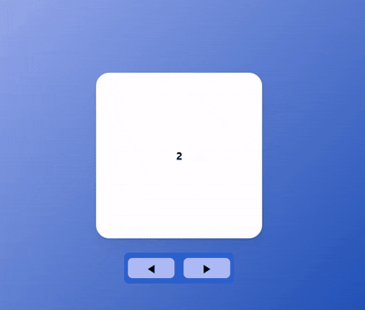
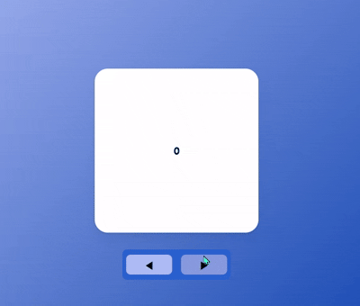
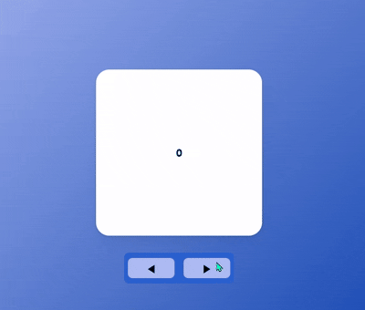

### Slider, Part 1

- 이전 파트인 `AnimatePresence`에서 이어지는 내용입니다.
- **[`AnimatePresence`](/AnimatePresence.md) 👈 이전 내용**

---
### 예제 1

#### 예제 설명


- 이번에는 `AnimatePresence` 활용해서 
- 아래 버튼을 클릭하면, 위의 하얀색 박스 (편의 상 `Tab` 하겠다.)가 넘어가는 <br/>
	통칭 `Slider` 예제를 만들어 보겠다.

- 기본적인 소스코드는 다음과 같다.
- 기능적인 부분은 구현하지 않고, `Style`만 구현한 것이다.

``` tsx
import {useState} from "react";
import {styled} from "styled-components";
import {motion, AnimatePresence} from "framer-motion";

const Wrapper = styled.div`
	display: flex;
	justify-content: center;
	align-items: center;
	flex-direction: column;
	width: 100vw;
	height: 100vh;
	background: linear-gradient(
		135deg, rgb(174, 188, 244), rgb(8, 62, 171)
	);
`;

const Tab = styled(motion.div)`
	display: flex;
	justify-content: center;
	align-items: center;
	font-weight: bold;
	width: 250px;
	height: 250px;
	background-color: white;
	border-radius: 20px;
	box-shadow: 0 2px 3px rgba(0, 0, 0, 0.1), 0 10px 20px rgba(0, 0, 0, 0.06);
	margin-bottom: 5px;
	position: absolute;
`;

const SliderBtns = styled.div`
	width: 160px;
	height: 40px;
	position: absolute;
	top: 500px;
	display: flex;
	justify-content: space-between;
	align-items: center;
	border: 0px;
	border-radius: 7px;
	padding: 3px;
	background-color: rgb(43, 97, 207);
`;

const Btn = styled.button`
	width: 70px;
	height: 30px;
	font-size: 16px;
	border: 0px;
	border-radius: 7px;
	background-color: rgb(174, 188, 244);
	margin: 0px 3px;
`;

export function SliderExam(){
	const [Index, setIndex] = useState(0);
	const Tabs = [0, 1, 2, 3, 4, 5, 6, 7, 8, 9];
	
	return (
		<Wrapper>
			<AnimatePresence>
				{
					Tabs.map((num) => {
						return (
							num === Index ? <Tab>{num}</Tab>
							: null
						);
					})
				}
			</AnimatePresence>
			<SliderBtns>
				<Btn>◀</Btn>
				<Btn>▶</Btn>
			</SliderBtns>
		</Wrapper>
	);
}
```

- 위의 예제에서 `state(Index)`의 값을 바꾸면
- 그에 맞게 `<Tab />`의 번호도 바뀐다.

- 이제 버튼을 누르면, 다음 번호의 `Tab`으로 넘어가는 기능과
- `Tab`이 넘어가는 애니메이션 효과까지 추가해보자.

---

#### 예제 업데이트 1 (`Tab` 슬라이드, 애니메이션 추가)

``` tsx
import {styled} from "styled-components";
import {motion, AnimatePresence} from "framer-motion";

const Wrapper = styled.div`...`;
const Tab = styled(motion.div)`...`;
const SliderBtns = styled.div`...`;
const Btn = styled.button`...`;

const TabVariants = {
	initial: {
		opacity: 0,
		x: 100
	},
	changeTabs: {
		opacity: 1,
		x: 0,
		transition: {
			delay: 0.5,
			duration: 0.6
		}
	},
	exitTabs: {
		opacity: 0,
		x: -100,
		transition: {
			duration: 0.5
		}
	}
};

export function SliderExam(){
	const [Index, setIndex] = useState(0);
	
	const nextTabs = () => {
		setIndex((values) => values === 9 ? 0 : values + 1);
	};
	
	const prevTabs = () => {
		setIndex((values) => values === 0 ? 9 : values - 1);
	}
	
	return (
		<Wrapper>
			<AnimatePresence>
				<Tab 
					key={Index}
					variants={TabVariants}
					initial="initial"
					animate="changeTabs"
					exit="exitTabs"
				>{Index}</Tab>
			</AnimatePresence>
			<SliderBtns>
				<Btn onClick={prevTabs}>◀</Btn>
				<Btn onClick={nextTabs}>▶</Btn>
			</SliderBtns>
		</Wrapper>
	);
}
```

- `Tab`의 번호를 나타내던 `Tabs` 배열을 삭제하고

- 대신 `Btn`의 `onClick` event Listener를 통해서 <br/>
	현재 `Tab` 번호가 `0, 9` 둘 중 하나 인 상태에서, 범위를 초과하지 않도록 <br/>
	번호가 `0`일 때 `이전` 버튼을 누르면, `9`번 `Tab`으로 넘어가고 <br/>
	현재 `Tab` 번호가 `9`인 상태에서 `다음` 버튼을 누르면 `0`번이 되게 하였다.

- 그 다음은 `TabVariants`에 애니메이션 코드를 작성하고 
- `<Tab />`이 `DOM`에서 삭제될 때, 애니메이션이 실행될 수 있도록 <br/>
	`<Tab />`을 `<AnimatePresence/>`로 감싸주었다.

- 최종 실행 결과는 다음과 같이 나온다.



- 예제를 실행하는 모습을 보면, 어떤 버튼을 누르던 <br/>
	`Tab`이 한 방향으로만 움직이는 것을 볼 수 있다.

- 각 버튼을 눌렀을 때, 누른 버튼에 따라 `Tab`이 다른 방향으로 움직이게 해보자.

- 각 버튼 별로 애니메이션 효과를 만들 수는 없으니 <br/>
	`<motion />` Component의 `custom`이라는 `props` 통해서 <br/>
	누른 버튼에 따라 `<Tab />`을 다른 방향으로 이동하게 할 것이다.

---

#### 예제 업데이트 2 (`Tab` 애니메이션 수정)

- **`<motion />, 'custom' property`**
	- `Variants`에 동적인 값을 전달할 수 있는 `property`
	- 단순 값 외에도 변수나 `state`도 전달 가능

``` tsx
const Variants = {
	animate: (custom: boolean) => ({
		opacity: 1,
		x: custom ? 100 : -100
	})
}

return (
	<Wrapper>
		<motion.div custom={true} variants={Variants}/>
		<motion.div custom={false} variants={Variants}/>
	</Wrapper>
);
```

---

- `custom`이 어떤 기능을 하는 지 알았으니, 이제 이를 적용해보자.

- 특정 버튼의 클릭 여부를 확인하는 `state`를 하나 만들고 <br/>
- 각 버튼의 `onClick Event Listener` 통해 해당 `state`의 값을 바꾸고 <br/>
	`state`의 값에 따라서 이에 맞게 `<Tab />`의 위치를 각기 다르게 설정한다.

- 코드를 통해서 확인해보자.

``` tsx
import {styled} from "styled-components";
import {motion, AnimatePresence} from "framer-motion";

const Wrapper = styled.div`...`;
const Tab = styled(motion.div)`...`;
const SliderBtns = styled.div`...`;
const Btn = styled.button`...`;

const TabVariants = {
	initial: (isNext: boolean) => ({
		opacity: 0,
		x: (isNext ? 100 : -100)
	}),
	changeTabs: {
		opacity: 1,
		x: 0,
		transition: {
			delay: 0.5,
			duration: 0.6
		}
	},
	exitTabs: (isNext: boolean) => ({
		opacity: 0,
		x: (isNext ? -100 : 100),
		transition: {
			duration: 0.5
		}
	})
};

export function SliderExam(){
	const [Index, setIndex] = useState(0);
	const [isNext, setNext] = useState(false);
	
	const nextTabs = () => {
		setNext(true);
		setIndex((values) => values === 9 ? 0 : values + 1);
	};
	
	const prevTabs = () => {
		setNext(false);
		setIndex((values) => values === 0 ? 9 : values - 1);
	}
	
	return (
		<Wrapper>
			<AnimatePresence>
				<Tab 
					key={Index}
					variants={TabVariants}
					initial="initial"
					animate="changeTabs"
					exit="exitTabs"
					custom={isNext}
				>{Index}</Tab>
			</AnimatePresence>
			<SliderBtns>
				<Btn onClick={prevTabs}>◀</Btn>
				<Btn onClick={nextTabs}>▶</Btn>
			</SliderBtns>
		</Wrapper>
	);
};
```

- `[◀]`, 이전 `Tab` 버튼을 클릭하면, `Tab`이 왼쪽 방향으로 넘어가고
- `[▶]`, 다음 `Tab` 버튼을 클릭하면, `Tab`이 오른쪽 방향으로 넘어간다.

---

#### `Tab` 전환 애니메이션 이슈



- `[◀], [▶]` 버튼 어느 쪽이든 클릭한 뒤에, 해당 버튼과 반대되는 버튼 클릭 시
-  `Tab` 전환 애니메이션이 자연스럽게 실행되지 않는 이슈가 생겼다.

- 이는 버튼 클릭 여부를 관측하는 `state`의 `setState()` 함수를 <br/>
	비동기로 동작하게끔 설정해서 해결할 수 있었다. <br/>

``` tsx
//수정한 부분만 발췌하였음.
//next, prev button, onClick Event Listener만 수정하였음.

function SliderExam(){
	const nextTabs = async () => {
		await setNext(true);
		setIndex((values) => values === 9 ? 0 : values + 1);
	};
	
	const prevTabs = async () => {
		await setNext(false);
		setIndex((values) => values === 0 ? 9 : values - 1);
	};
	
	return (/*...*/)
}
```

- 이제 예제를 확인해보면, `Tab` 전환이 자연스럽게 되는 것을 확인할 수 있다.




---


