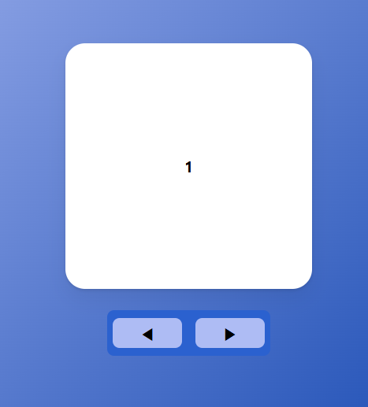

### Slider, Part 1

- 이전 파트인 `AnimatePresence`에서 이어지는 내용입니다.
- **[`AnimatePresence`](/AnimatePresence.md) 👈 이전 게시글**

---
### 예제 1

#### 예제 설명



- 이번에는 `AnimatePresence` 활용해서 
- 아래 버튼을 클릭하면, 위의 하얀색 박스 (편의 상 `Tab` 하겠다.)가 넘어가는 <br/>
	통칭 `Slider` 예제를 만들어 보겠다.

- 기본적인 소스코드는 다음과 같다.
- 기능적인 부분은 구현하지 않고, `Style`만 구현한 것이다.

``` tsx
import {useState} from "react";
import {styled} from "styled-components";
import {motion, AnimatePresence} from "framer-motion";

const Wrapper = styled.div`
	display: flex;
	justify-content: center;
	align-items: center;
	flex-direction: column;
	width: 100vw;
	height: 100vh;
	background: linear-gradient(
		135deg, rgb(174, 188, 244), rgb(8, 62, 171)
	);
`;

const Box = styled(motion.div)`
	display: flex;
	justify-content: center;
	align-items: center;
	font-weight: bold;
	width: 250px;
	height: 250px;
	background-color: white;
	border-radius: 20px;
	box-shadow: 0 2px 3px rgba(0, 0, 0, 0.1), 0 10px 20px rgba(0, 0, 0, 0.06);
	margin-bottom: 5px;
	position: absolute;
`;

const SliderBtns = styled.div`
	width: 160px;
	height: 40px;
	position: absolute;
	top: 500px;
	display: flex;
	justify-content: space-between;
	align-items: center;
	border: 0px;
	border-radius: 7px;
	padding: 3px;
	background-color: rgb(43, 97, 207);
`;

const Btns = styled.button`
	width: 70px;
	height: 30px;
	font-size: 16px;
	border: 0px;
	border-radius: 7px;
	background-color: rgb(174, 188, 244);
	margin: 0px 3px;
`;

export function SliderExam(){
	const [Index, setIndex] = useState(0);
	const Tabs = [0, 1, 2, 3, 4, 5, 6, 7, 8, 9];
	
	return (
		<Wrapper>
			<AnimatePresence>
				{
					Tabs.map((num) => {
						return (
							num === Index ? <Box>{num}</Box>
							: null
						);
					})
				}
			</AnimatePresence>
			<SliderBtns>
				<Btns>◀</Btns>
				<Btns>▶</Btns>
			</SliderBtns>
		</Wrapper>
	);
}
```

- 위의 예제에서 `state(Index)`의 값을 바꾸면
- 그에 맞게 `<Box />`의 번호도 바뀐다.

- 이제 버튼을 누르면, `<Box />`가 자동으로 다음 번호로 넘어가고
- `<Box />`가 넘어가는 애니메이션 효과까지 추가해보겠다.

---


