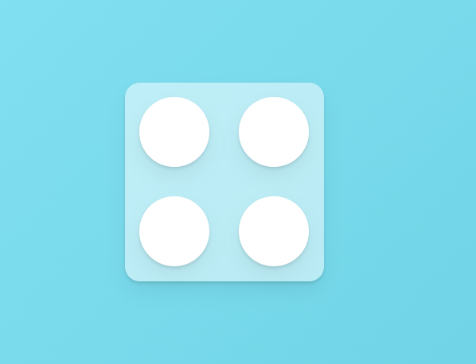

### `Variants`

#### `Variants, Part 1`

- Components가 가질 수 있는 미리 정의된 시각적 `state`
- `motion components`에서 사용할  `Animation state` 미리 정의할 수 있다.

- 이전에 만들어둔 `Animation` 예제에 `Variants` 적용해보자.

``` tsx
import {motion} from "framer-motion";
import {styled} from "styled-components";

//variants props에 전달하기 위해 만든 객체
//여러 <motion/>에 적용하려고 만든 Animation Sample이라고 생각하자.

const VarSamples = {
	start: { scale: 0 }, //<-> initial
	end: {
		scale: 1,
		rotateZ: 360,
		transition: {
			type: "spring",
			delay: 1,
			duration: 2
		}
	} //<-> animate (+transition)
};

function App(){
	/** 
		Before Code's
		<Box 
			initial={{scale: 0}}
			animate={{scale: 1, rotateZ: 360}}
			transition={{type: "spring", delay: 1, duration: 2}}
		/>
	*/
	//After Code's (use variants)
	return (
		<Wrapper>
			<Box
				variants={VarSamples} 
				initial="start"
				animate="end"
			/>
		</Wrapper>
	);
	/*
		'initial="start" animate="end"' 식으로 해도되고
		아니면 initial={VarSamples.start} animate={VarSamples.end}
		형식으로 설정해도 둘 다 문제 없이 적용된다.
	*/
};
```

---

#### `Variants, Part 2`

- 이번에는 이런 식으로 생긴 예제를 만들어 보려고 한다.
- (Variants 예제 이미지.gif)

- `<Box />` Components 내부에 총 4개의 `<Circle />` 추가하였다.
- 물론 이 과정에서 `<Box />`의 CSS 설정도 좀 건드렸다.



``` tsx
const Box = styled(motion.div)`
	width: 200px;
	height: 200px;
	background-color: rgba(255, 255, 255, 0.5);
	border-radius: 15px;
	box-shadow: 0 2px 3px rgba(0, 0, 0, 0.1), 0 10px 20px rgba(0, 0, 0, 0.06);
	display: grid;
	grid-template-columns: repeat(2, 1fr);
`;
//배경색 수정, 내부 요소 배치 설정 추가


const Circle = styled(motion.div)`
	background-color: white;
	width: 70px;
	height: 70px;
	border-radius: 35px;
	box-shadow: 0 2px 3px rgba(0, 0, 0, 0.1), 0 10px 20px rgba(0, 0, 0, 0.06);
	place-self: center;
`;

const BoxVariants = {
	start: {
		opacity: 0,
		scale: 0.5
	},
	end: {
		opacity: 1,
		scale: 1,
		transition: {
			type: "spring",
			delay: 0.5,
			duration: 0.5,
			bounce: 0.5
		}
	}
};
/*
	opacity 
	- 요소의 불투명도를 설정하는 CSS 속성
	- 요소 뒤쪽의 콘텐츠가 숨겨지는 정도를 불투명도라고 한다.
*/

function VariantsSample(){
	return (
		<Wrapper>
			<Box variants={}>
				<Circle />
				<Circle />
				<Circle />
				<Circle />
			</Box>
		</Wrapper>
	);
};
```

- 여기서 부모 요소인 `<Box />`에 `Variants` 통해 `Animation` 설정을 전달하면
- 자식 요소인 `<Circle />`에도 똑같이 적용이 된다.

- 쉽게 이야기 하자면, `<Box />`의  `initial, animate` <br/>
	두 개의 `props`의 값을 `<Circle />`이 상속 받는 것이다.
 
- 이러한 특성을 알았으니  `Circle`의 `Variants` 만들 때 참고해두자.

- `Animation object`의 `key` 값을 동일하게 `start, end`로 설정하면 <br/>
	`<Circle />`에서 `initial, animate props`의 값을 별도로 지정할 필요가 없다.

``` tsx
//CircleVariants 추가
const Box = styled(motion.div)``;


const Circle = styled(motion.div)``;

const BoxVariants = {/*기존 코드*/};

const CircleVariants = {
	start: { scale: 0 },
	end: {
		scale: 1,
		transition: {
			type: "spring",
			duration: 0.5,
			delay: 0.7
		}
	}
};

function VariantsSample(){
	return (
		<Wrapper>
			<Box variants={BoxVariants} initial="start" animate="end">
				<Circle variants={CircleVariants}/>
				<Circle variants={CircleVariants}/>
				<Circle variants={CircleVariants}/>
				<Circle variants={CircleVariants}/>
			</Box>
		</Wrapper>
	);
};
```

- 예제를 실행하면 제일 먼저 `<Box />` 나오고 <br/>
- 0.2초 뒤에 `<Circle />` 4개가 한 번에 나타나는 것을 확인할 수 있다.

---

### `Orchestration`

-  `Animation` 효과의 지휘자 같은 역할을 수행하는 개념
- 비슷한 `Animation`을 순차적으로 진행하려고 할 때 <br/>
	`delay`나 반복 횟수를 설정할 때 주로 사용한다.

- 이를 활용해서 4개의 `<Circle />`,  순차적으로 나타나게 할 수 있다.

- 예제에서만 사용한 것을 정리했기 때문에, 여기서 다루지 않은 <br/>
	나머지 것들은 아래 공식 문서 링크를 통해서 확인할 수 있다.

- **[`Orchestration`](https://motion.dev/docs/react-animation#orchestration)**


---
#### `delayChildren: [Delay Time]`

- 부모 요소 `Variants`에서 설정
- 자식 요소에게 동일한 `Delay` 전달하는 속성

#### `staggerChildren: [delay time]`

- 마찬가지로 부모 요소 `Variants`에서 설정
- 자식 요소에게 자동으로 순차적인 `delay` 주는 속성이다.

---

- 이를 예제에 적용하면, 4개의 `<Circle />` 순차적으로 나타나게 할 수 있다.

``` tsx
//Circle 4개, 순차적으로 표시되게 수정
const BoxVariants = {
	start: {
		opacity: 0,
		scale: 0.5
	},
	end: {
		opacity: 1,
		scale: 1,
		transition: {
			type: "spring",
			delay: 0.5,
			duration: 0.5,
			bounce: 0.5,
			
			//New
			delayChildren: 0.5,
			staggerChildren: 0.5
		}
	}
};

const CircleVariants = {
	start: {
		scale: 0,
	},
	end: {
		scale: 1,
		transition: {
			type: "spring",
			duration: 0.1,
			//delay: 0.7
		}
	}
};

function VariantsSample(){
	return (
		<Wrapper>
			<Box variants={BoxVariants} initial="start" animate="end">
				<Circle variants={CircleVariants}/>
				<Circle variants={CircleVariants}/>
				<Circle variants={CircleVariants}/>
				<Circle variants={CircleVariants}/>
			</Box>
		</Wrapper>
	);
};
```